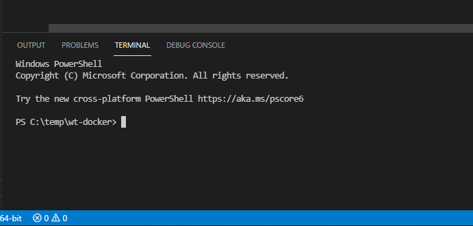
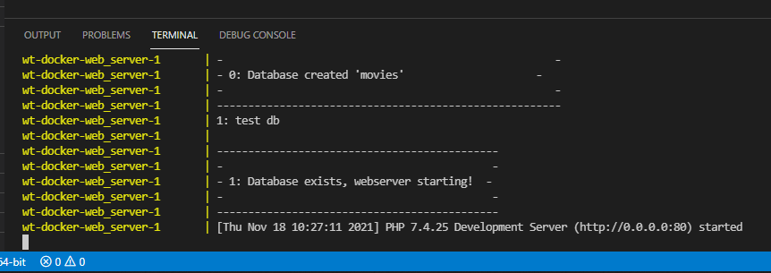

# WT-IS: Docker webserver met database

Deze omgeving maakt een database server en een web server aan gebaseerd
op [Docker](https://www.docker.com/). Bij het opstarten van de omgeving
wordt automatisch de database *Fletnix* aangemaakt en gevuld met
voorbeelddata.

***Let op, deze omgeving is specifiek bedoeld als educatieve omgeving.
Deze omgeving kan niet gebruikt worden voor productie-omgevingen,
hiervoor zullen eerst nog een groot aantal beveilingsaspecten opgelost
moeten worden (wachtwoorden zijn eenvoudig te achterhalen, er wordt
gebruik gemaakt van de [Built-in web
server](https://www.php.net/manual/en/features.commandline.webserver.php),
etc. etc.).***

## Benodigde software

De volgende software heb je nodig:

### Docker (verplicht)

Installeer Docker: <https://www.docker.com/get-started>. Voor zowel
Windows, Mac als Linux zijn er installaties beschikbaar.

### Visual Studio Code (aanbevolen)

Installeer Visual Studio Code: <https://code.visualstudio.com/>
Waarschijnlijk heb je deze al geïnstalleerd en gebruik je die al om je
HTML-pagina's te maken.

## Eerste keer opstarten en aanmaken omgeving

Bij de eerste keer opstarten van de omgeving worden er veel bestanden
gedownload en duurt het even voordat alles klaar is.

### Clone GitHub-repository naar lokale machine

Clone of download de volledige repository van deze omgeving naar je
lokale machine.

Als je gebruik maakt van GitHub Desktop, klik in de Github-repo op 'Open
with GitHub Desktop'.

### Visual Studio Code: aanmaken van servers

Open met Visual Studio Code de map waarin je repository hebt gecloned.
Met GitHub Desktop: klik op 'Open with Visual Studio Code'.

Onderin Visual Studio Code zou een *terminal* open moeten staan. Als dit
niet het geval is, kies in het menu van Visual Studio Code onder
*Terminal* de optie *New terminal*.

.

Type in de terminal `docker compose up` en daarna *enter*.

Nu worden een database server en een web server aangemaakt. Daarna
worden beide servers opgestart en de *Fletnix* database wordt
automatisch aangemaakt en gevuld. Tijdens dit proces zie je een
behoorlijk aantal meldingen voorbij komen.

*Soms krijg je bij stap 18/19 een foutmelding **ERROR \[18/19\] RUN pecl
install pdo_sqlsrv**. De installatie haalt bestanden van het internet
af, de server die bij deze stap hoort wil nog wel een offline zijn.
Wacht een paar minuten en probeer nog eens.*

Uiteindelijk moet de volgende melding in beeld verschijnen **Database
exists, webserver starting!**. Zoiets als



Test de webserver:

-   *It works!*: <http://localhost:8080> of
    <http://localhost:8080/index.php>
-   *phpinfo*: <http://localhost:8080/phpinfo.php>
-   *Data uit de database*: <http://localhost:8080/moviegenres.php>

## Je eigen bestanden

De bestanden die de webserver gebruikt staan in de map `./applicatie/`,
hier moet je je beroepsproduct in uitwerken.

### Eerste php-bestand

Maak een nieuw bestand aan in de map `./applicatie/` en noem deze
`test.php`. Open dit bestand met Visual Studio Code en voeg de volgende
code toe:

``` .php
<?php
echo ('Hallo **je eigen naam**');
?>
```

Roep de `test.php` in je webbrowser (op de localhost:8080). Als het goed
is zie je de melding *Hallo, \*\*je eigen naam\*\** verschijnen.

### Fletnix applicatie

Kopieer al je HTML-bestanden naar de map `./applicatie/` en verander van
elke bestand de extensie naar `.php`. Roep als test alle bestanden aan
via je browser. Maak nu je web-applicatie zodanig dat deze optimaal van
opzet is en dat de gegevens in de site uit de database gehaald worden.
Zie de lesstof hoe je dat allemaal doet.

Tip: in het bestand `moviegenres.php` (in combinatie met
`db_connectie.php`) kun je een voorbeeld zien hoe je verbinding maakt
met een database en gegevens in een webpagina plaats.

## Problemen oplossen

### Database

Verbinding

### Unable to connect

Als je een melding krijgt dat de pagina niet bereikbaar is

1.  Controleer in de URL of je http://localhost:8080 correct gespeld
    hebt.
2.  Controleer of je in de URL het bestandsnaam (met *.php*) correct
    gespeld hebt.
3.  Controleer of Docker opgestart is.
4.  Controleer of de servers opgestart zijn (type in de VS-code terminal
    `docker compose ls -a` daar moet je docker-omgeving staan met als
    status *running(2)*).
5.  Reboot je machine.

### This error may indicate that the docker daemon is not running.

Als je de melding *error during connect: This error may indicate that
the docker daemon is not running.* dan heb je docker niet opgestart.
Start Docker op of reboot je machine.
